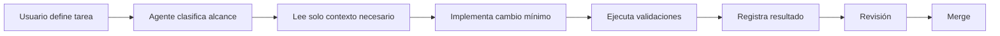

# Pipeline de desarrollo

## Flujo

## Reglas

1. Usuario define alcance y requisitos de cada tarea.
2. Agente lee solo archivos relevantes.
3. Cada cambio mantiene alcance pequeño.
4. Pruebas usan IDs estables y eventos append-only.
5. Resultados enlazan `test`, `run` y evidencia.
6. Bitácora registra trabajo completado; nunca se reescribe.
7. Revisión ocurre antes del merge.

## Archivos clave

| Archivo | Función |
|---|---|
| `AGENTS.md` | Reglas de agentes y lectura contextual |
| `docs/contexto.md` | Estado técnico actual |
| `docs/bitacora.ndjson` | Historial técnico append-only |
| `docs/testing/README.md` | Instrucciones de pruebas |
| `docs/testing/events.ndjson` | Eventos de pruebas |
| `docs/testing/dashboard/` | Dashboard generado |
